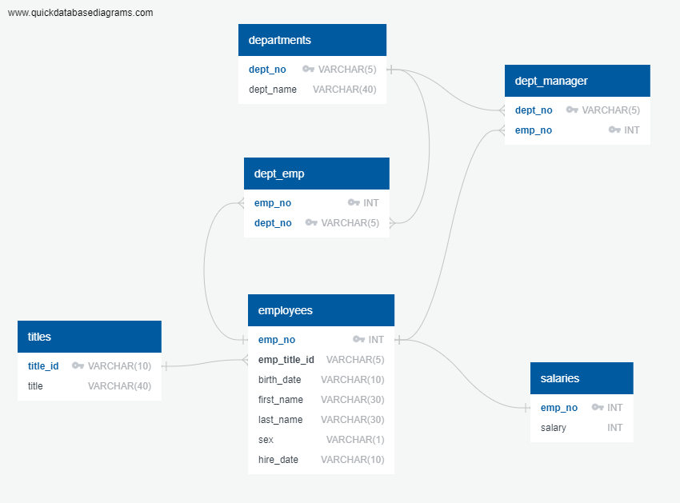

# sql-challenge

## Data Modeling



## Data Engineering

```CREATE TABLE "departments" (
    "dept_no" VARCHAR(5) NOT NULL,
    "dept_name" VARCHAR(40) NOT NULL,
    CONSTRAINT "pk_departments" PRIMARY KEY (
        "dept_no"
     )
);

CREATE TABLE "titles" (
    "title_id" VARCHAR(10) NOT NULL,
    "title" VARCHAR(40) NOT NULL,
    CONSTRAINT "pk_titles" PRIMARY KEY (
        "title_id"
     )
);

CREATE TABLE "employees" (
    "emp_no" INT NOT NULL,
    "emp_title_id" VARCHAR(5) NOT NULL,
    "birth_date" DATE(10)NOT NULL,
    "first_name" VARCHAR(30) NOT NULL,
    "last_name" VARCHAR(30) NOT NULL,
    "sex" VARCHAR(1) NOT NULL,
    "hire_date" DATE(10) NOT NULL,
    CONSTRAINT "pk_employees" PRIMARY KEY (
        "emp_no"
     )
);

CREATE TABLE "dept_emp" (
    "emp_no" INT NOT NULL,
    "dept_no" VARCHAR(5) NOT NULL
);

CREATE TABLE "dept_manager" (
    "dept_no" VARCHAR(5) NOT NULL,
    "emp_no" INT NOT NULL
);

CREATE TABLE "salaries" (
    "emp_no" INT NOT NULL,
    "salary" INT NOT NULL
);

```
   

## Data Analysis

1. The query to list the following details of each employee: employee number, last name, first name, sex, and salary

```SELECT employees.emp_no, employees.last_name, employees.first_name, employees.sex, salaries.salary
FROM employees
JOIN salaries
ON employees.emp_no = salaries.emp_no;

```
   
2. The query to list first name, last name, and hire date for employees who were hired in 1986.

```
SELECT first_name, last_name, hire_date 
FROM employees
WHERE hire_date BETWEEN '1986-01-01' AND '1987-01-01';

 ```

3. The query list the manager of each department with the following information: department number, department name, the manager's employee number, last name, first name.
```employee number, last name, first name.
SELECT departments.dept_no, departments.dept_name, dept_manager.emp_no, employees.last_name, employees.first_name
FROM departments
JOIN dept_manager
ON departments.dept_no = dept_manager.dept_no
JOIN employees
ON dept_manager.emp_no = employees.emp_no;
 ```

4. The query to list the department of each employee with the following information: employee number, last name, first name, and department name.
 ```SELECT dept_emp.emp_no, employees.last_name, employees.first_name, departments.dept_name
FROM dept_emp
JOIN employees
ON dept_emp.emp_no = employees.emp_no
JOIN departments
ON dept_emp.dept_no = departments.dept_no;
 
 ```
5. The query to list first name, last name, and sex for employees whose first name is "Hercules" and last names begin with "B."

```SELECT first_name, last_name,sex
FROM employees
WHERE first_name = 'Hercules'
AND last_name LIKE 'B%';

 ```

6. The query to list all employees in the Sales department, including their employee number, last name, first name, and department name.

```SELECT dept_emp.emp_no, employees.last_name, employees.first_name, departments.dept_name
FROM dept_emp
JOIN employees
ON dept_emp.emp_no = employees.emp_no
JOIN departments
ON dept_emp.dept_no = departments.dept_no
WHERE departments.dept_name = 'Sales';

 ```
7. The query to list all employees in the Sales and Development departments, including their employee number, last name, first name, and department name.

```SELECT dept_emp.emp_no, employees.last_name, employees.first_name, departments.dept_name
FROM dept_emp
JOIN employees
ON dept_emp.emp_no = employees.emp_no
JOIN departments
ON dept_emp.dept_no = departments.dept_no
WHERE departments.dept_name = 'Sales' 
OR departments.dept_name = 'Development'
 ```

8. In descending order, list the frequency count of employee last names, i.e., how many employees share each last name.

```SELECT last_name,
COUNT(last_name) AS "frequency"
FROM employees
GROUP BY last_name
ORDER BY
COUNT(last_name) DESC;

 ```
